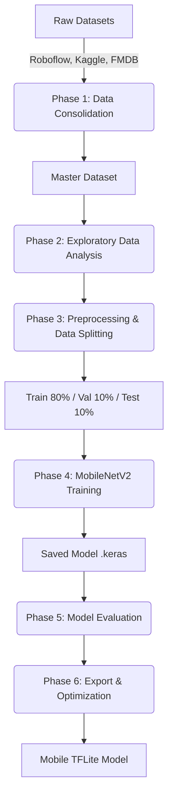
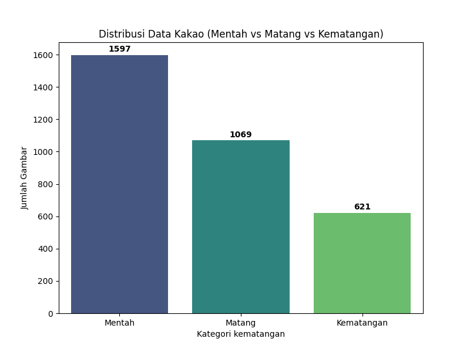
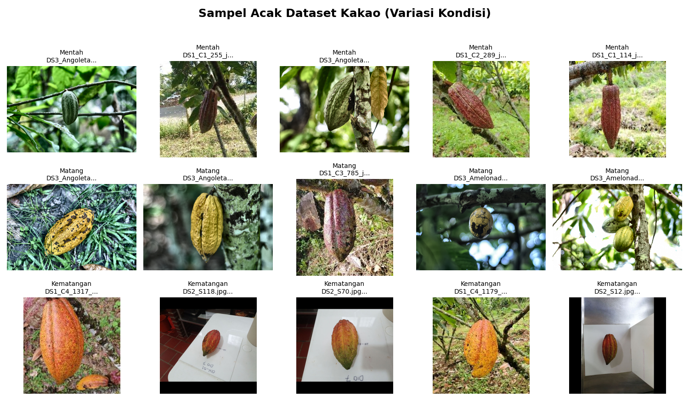
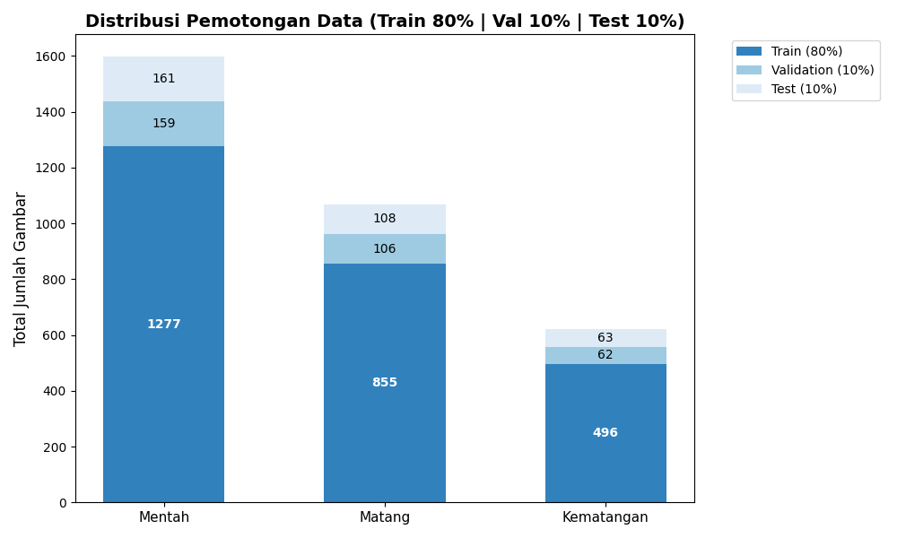
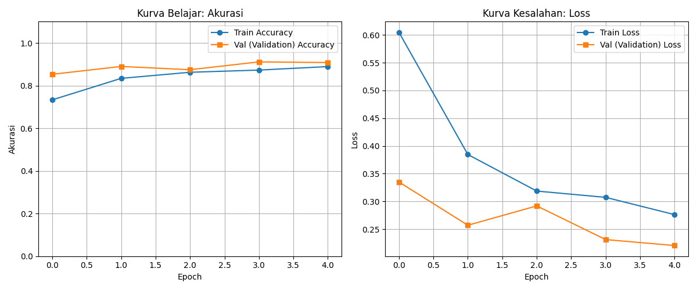
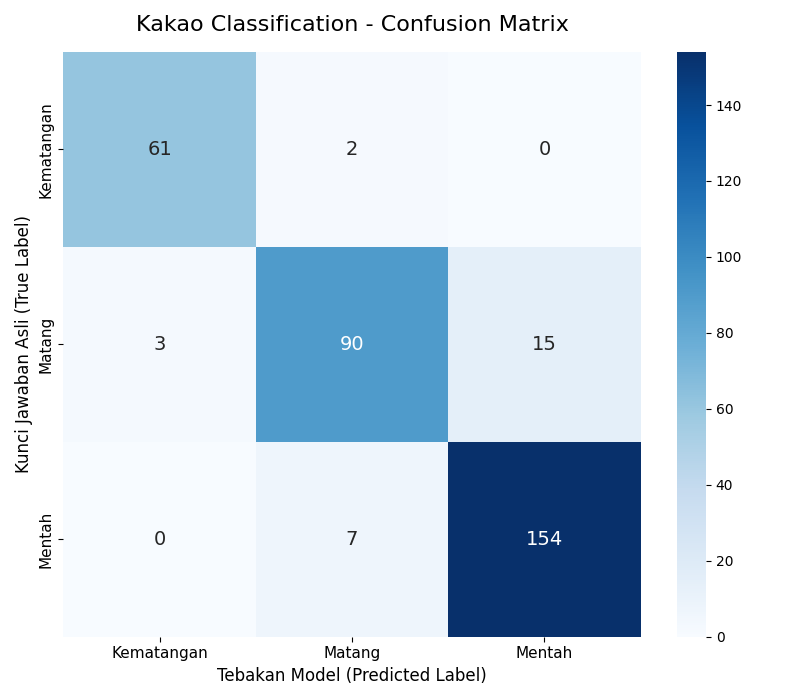
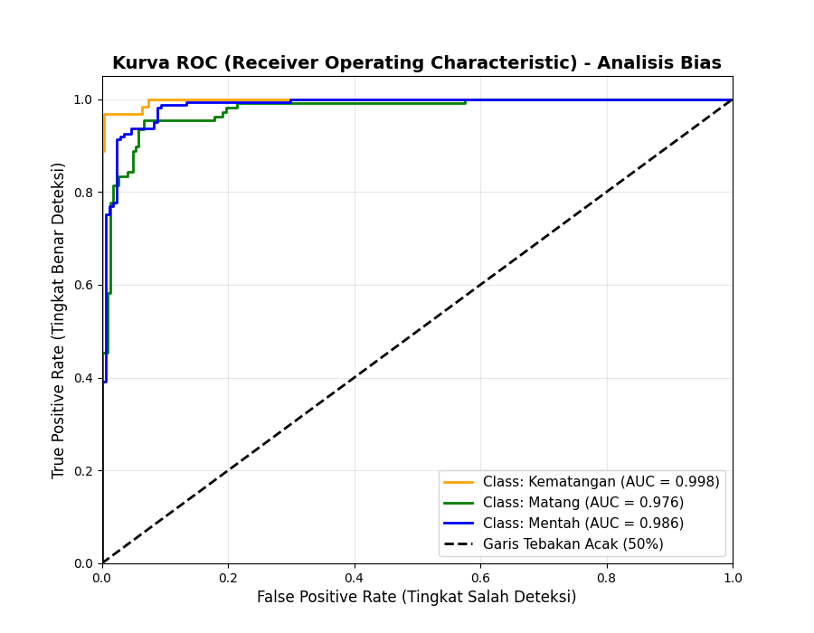

# Cocoa Ripeness Classification using Deep Learning

This repository contains the end-to-end Machine Learning pipeline for developing a robust Computer Vision model that classifies the ripeness levels of cocoa pods into three distinct categories: Mentah (Unripe), Matang (Ripe), and Kematangan (Overripe). The final output is an optimized TensorFlow Lite (TFLite) model tailored for mobile application deployments (Android/iOS).

## Project Pipeline

The development pipeline was designed in six structured phases as illustrated below:

## Phase 1: Data Consolidation & Preparation

Three diverse public datasets were aggregated and structured into a unified `Master_Dataset`. During this phase, strict data sanitization protocols were executed to discard non-image metadata files (e.g., XML files from FMDB) and corrupted binaries.

The consolidated result yielded a total of **3.287 valid images**.

## Phase 2: Exploratory Data Analysis (EDA)

An exploratory analysis was performed to understand the class distribution and visually inspect the variance of the specimens.

### Class Distribution
- **Mentah**: 1597 images
- **Matang**: 1069 images
- **Kematangan**: 621 images

### Dataset Visual Sample Collage
Random sampling was conducted to visualize the visual transition between the cocoa states. The classification relies heavily on color gradations (green to yellow) and texture deterioration (black spots for overripe).

## Phase 3: Preprocessing & Data Splitting

To ensure proper training and independent evaluation, the `Master_Dataset` was physically partitioned into three subsets with an 80-10-10 ratio using a fixed random seed.

- **Training Set (80%)**: 2628 images
- **Validation Set (10%)**: 327 images
- **Test Set (10%)**: 332 images

## Phase 4: Model Development & Training

A Convolutional Neural Network (CNN) based on the **MobileNetV2** architecture (pre-trained on ImageNet) was implemented. The choice of MobileNetV2 is due to its high computational efficiency, making it the industry standard for mobile edge inference.

Custom Classification Head:
- `GlobalAveragePooling2D`
- `Dense` 128 (ReLU)
- `Dropout` (40%) to penalize overfitting.
- `Dense` 3 (Softmax) for ternary classification.

The model achieved over `91%` Validation Accuracy within 5 baseline epochs, indicating that the architecture captured the visual features perfectly without showing signs of over-memorization (overfitting).

## Phase 5: Model Evaluation and Bias Detection

The model was subjected to evaluation strictly using the unseen Test Set (332 images).

### Confusion Matrix
The overall test accuracy achieved was **92%**. The model demonstrated excellent precision on the exact boundary classes (Mentah and Kematangan). The only slight anomaly recorded was biological transitional noise, where borderline Matang instances were occasionally misclassified as Mentah due to ambiguous natural color grading.

### Bias Detection (ROC Curve)
To validate that the initial data imbalance did not introduce algorithmic bias, a Multi-class ROC Curve analysis was computed. The Area Under Curve (AUC) for all three classifications scored upwards of `0.980`, effectively disproving any bias toward the majority class (Mentah).

## Phase 6: Deliverables & App Integration

For system integration, the raw TensorFlow Keras model was compressed and natively quantized to TFLite format to suit the resource constraints of mobile processors.

The finalized inference artifacts consist of:
1. `models/model_kakao_optimized.tflite` - The compiled neural network core.
2. `models/class_indices.json` - The associative dictionary mapping the tensor output integers to structural strings (`{0: 'Kematangan', 1: 'Matang', 2: 'Mentah'}`).

These assets represent the full completion of the Computer Vision development sprint and are ready to be embedded into the application environment.
