# Klasifikasi Kematangan Buah Kakao

Repositori ini berisi pengembangan model computer vision untuk mengklasifikasikan tingkat kematangan buah kakao ke dalam tiga kelas:

- `Mentah`
- `Matang`
- `Kematangan`

Fokus utama project ini ada dua. Pertama, menyiapkan model yang bisa dipakai untuk integrasi aplikasi. Kedua, membandingkan beberapa pendekatan model yang masih relevan dengan karakter dataset, supaya keputusan model tidak hanya berdasarkan satu baseline.

## Ringkasan Progres

- Total data kurasi: `3.287` gambar
- Komposisi kelas: `Mentah 1597`, `Matang 1069`, `Kematangan 621`
- Split data: `2628 train`, `327 val`, `332 test`
- Model deployable yang sudah tersedia: `MobileNetV2 baseline`
- Model terbaik pada benchmark saat ini: `EfficientNetB0 Embeddings + Logistic Regression`
- Nilai uji terbaik:
  - Accuracy: `0.9518`
  - Precision macro: `0.9555`
  - Recall macro: `0.9523`
  - F1-score macro: `0.9539`

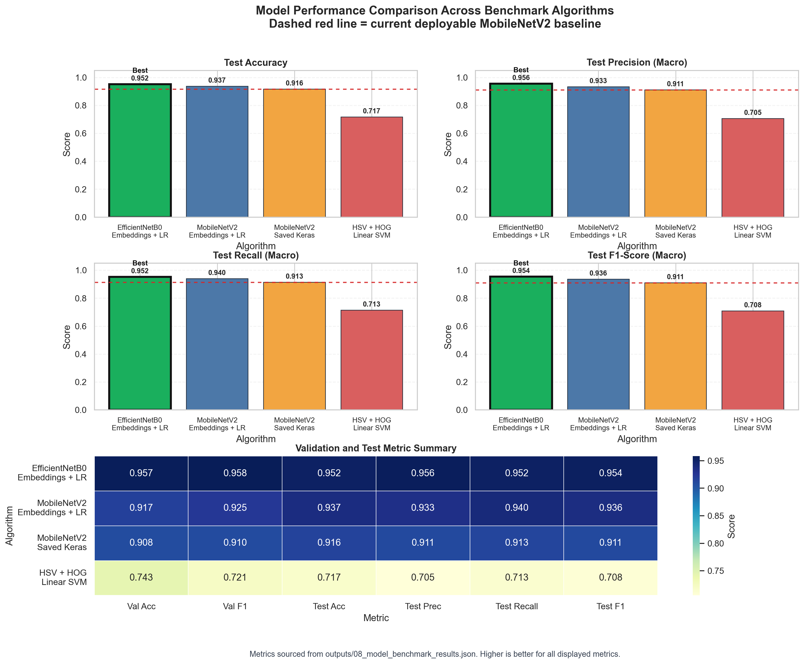

## Tujuan Project

Project ini dibuat untuk:

- membangun model klasifikasi 3 kelas untuk kondisi kematangan kakao
- menghasilkan artefak model yang bisa dipakai pada aplikasi
- memahami kualitas dataset sebelum model dipakai lebih jauh
- membandingkan beberapa algoritma yang memang cocok untuk data citra dengan jumlah menengah

## Alur Kerja

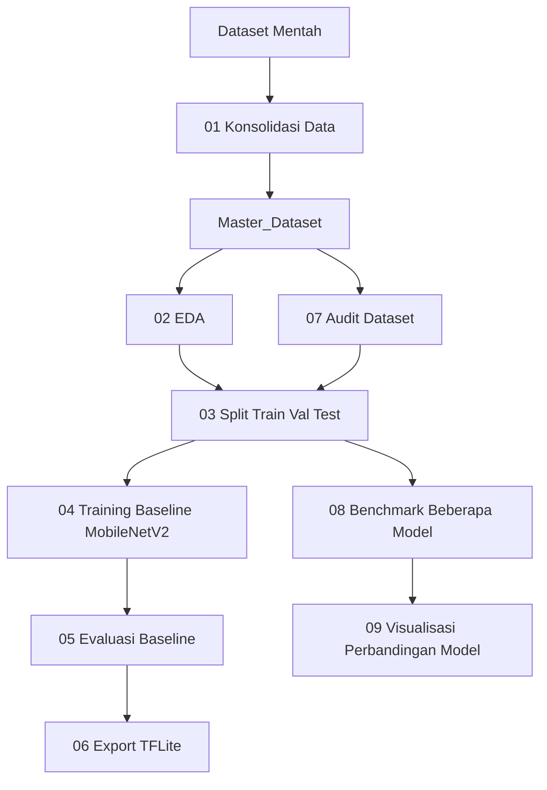
```mermaid
graph TD
    A[Dataset Mentah] --> B[01 Konsolidasi Data]
    B --> C[Master_Dataset]
    C --> D[02 EDA]
    C --> E[07 Audit Dataset]
    D --> F[03 Split Train Val Test]
    E --> F
    F --> G[04 Training Baseline MobileNetV2]
    G --> H[05 Evaluasi Baseline]
    H --> I[06 Export TFLite]
    F --> J[08 Benchmark Beberapa Model]
    J --> K[09 Visualisasi Perbandingan Model]
```

## Struktur Folder Penting

```text
.
|-- models/
|   |-- mobilenetv2_baseline/
|   |-- mobilenetv2_embeddings/
|   |-- efficientnetb0_embeddings/
|   `-- hog_linear_svm/
|-- outputs/
|-- scripts/
`-- requirements.txt
```

Folder `models/` sekarang dipisah per algoritma supaya artefaknya tidak bercampur.

- `models/mobilenetv2_baseline/`
  - `best_kakao_model.keras`
  - `model_kakao_optimized.tflite`
  - `class_indices.json`
  - `artifact_manifest.json`
- `models/mobilenetv2_embeddings/`
  - `classifier.joblib`
  - `feature_extractor.weights.h5`
  - `metadata.json`
- `models/efficientnetb0_embeddings/`
  - `classifier.joblib`
  - `feature_extractor.weights.h5`
  - `metadata.json`
- `models/hog_linear_svm/`
  - `classifier.joblib`
  - `metadata.json`

## Dataset

Dataset akhir merupakan gabungan dari tiga sumber data yang dikonsolidasikan ke dalam `Master_Dataset`. Setelah proses pembersihan file non-gambar dan verifikasi dasar, total data valid yang digunakan berjumlah `3.287` gambar.

### Distribusi Kelas

| Kelas | Jumlah | Persentase |
| --- | ---: | ---: |
| Mentah | 1597 | 48.59% |
| Matang | 1069 | 32.52% |
| Kematangan | 621 | 18.89% |

Distribusinya belum seimbang, tetapi masih cukup layak untuk transfer learning. Kelas `Kematangan` adalah kelas dengan jumlah data paling sedikit sehingga perlu perhatian saat training dan evaluasi.

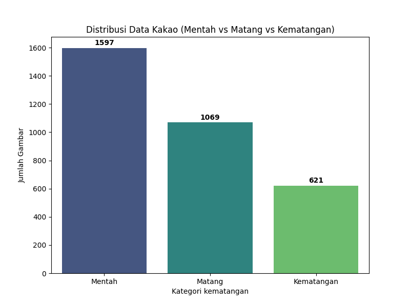

### Contoh Visual Dataset

Perbedaan antar kelas terutama terlihat dari perubahan warna kulit buah, intensitas kuning-hijau, dan gejala permukaan pada buah yang terlalu matang.

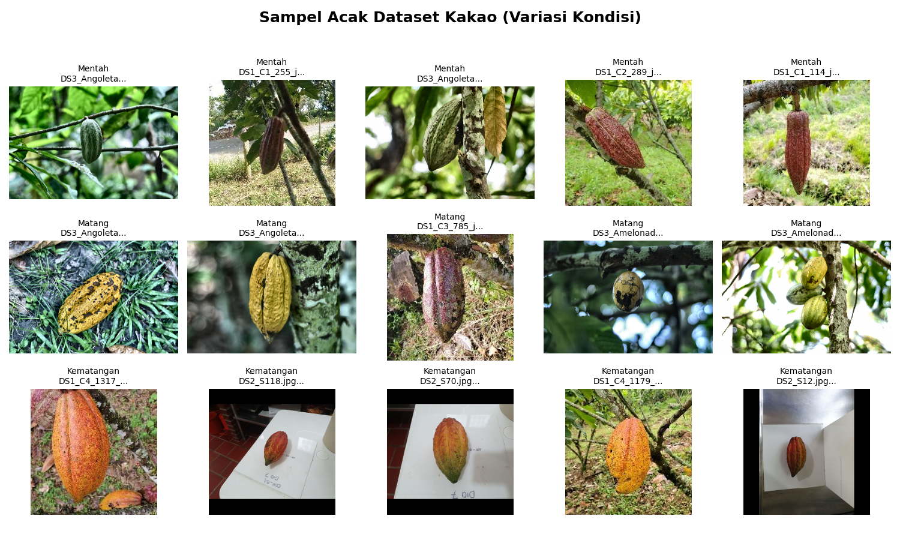

## Hasil Audit Dataset

Audit dataset dijalankan melalui [scripts/07_dataset_audit.py](scripts/07_dataset_audit.py). Bagian ini penting karena benchmark model akan lebih berguna kalau kondisi datanya dipahami lebih dulu.

### Temuan Utama

- Seluruh data berada dalam format `JPEG`
- Median resolusi gambar ada di sekitar `505 x 505`
- Rentang resolusi cukup lebar, dari `224` sampai `5568` piksel
- Rasio imbalance kelas tertinggi terhadap terendah adalah `2.5717x`
- Terdapat `4` grup duplikat exact di `Master_Dataset`
- Terdapat `1` grup duplikat exact yang bocor lintas `train` dan `test`

Temuan ini berarti dataset masih layak dipakai untuk eksperimen, tetapi belum ideal untuk evaluasi final tanpa deduplikasi dan split ulang.

### Bobot Kelas yang Disarankan

Bobot kelas berikut bisa dipakai saat training lanjutan:

- `Mentah`: `0.6861`
- `Matang`: `1.0249`
- `Kematangan`: `1.7644`

### Visual Audit

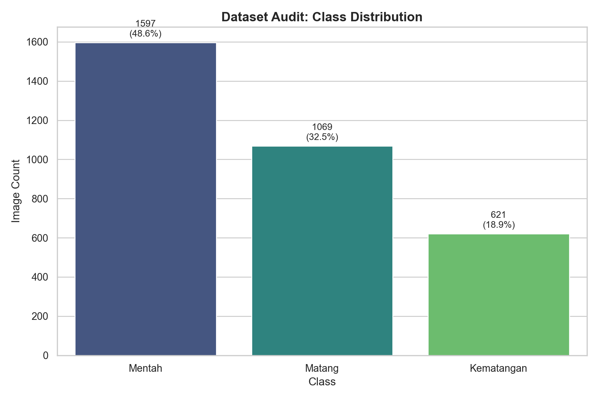

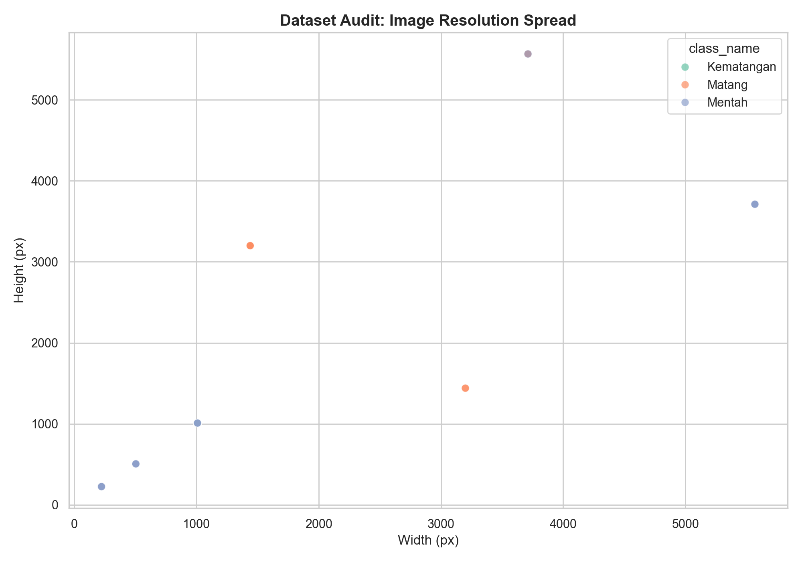

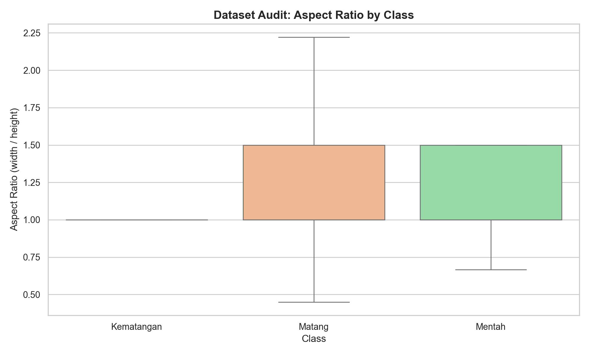

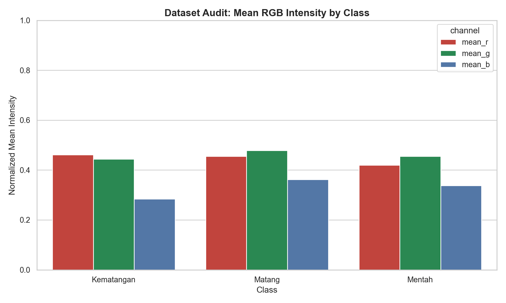

File hasil audit yang tersedia:

- [outputs/07_dataset_summary.json](outputs/07_dataset_summary.json)
- [outputs/07_dataset_inventory.csv](outputs/07_dataset_inventory.csv)
- [outputs/07_exact_duplicates.csv](outputs/07_exact_duplicates.csv)
- [outputs/07_cross_split_duplicates.csv](outputs/07_cross_split_duplicates.csv)

## Baseline Model

Baseline utama project ini adalah `MobileNetV2` dengan head klasifikasi sederhana. Backbone ImageNet dibekukan pada tahap awal training, lalu ditambahkan:

- `GlobalAveragePooling2D`
- `Dense(128, relu)`
- `Dropout(0.4)`
- `Dense(3, softmax)`

Model ini disimpan dalam dua bentuk:

- [models/mobilenetv2_baseline/best_kakao_model.keras](models/mobilenetv2_baseline/best_kakao_model.keras)
- [models/mobilenetv2_baseline/model_kakao_optimized.tflite](models/mobilenetv2_baseline/model_kakao_optimized.tflite)

### Split Data

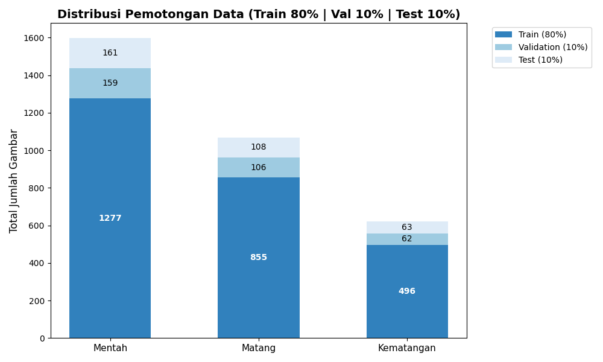

### Kurva Training Baseline

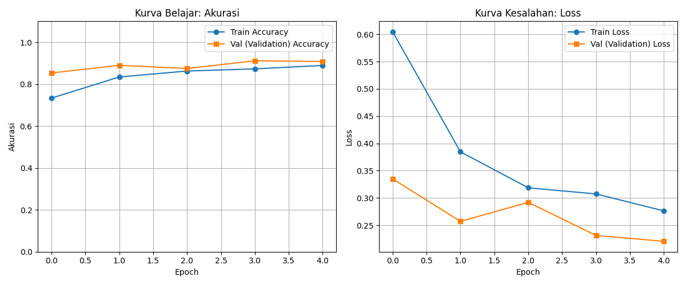

### Evaluasi Baseline

Baseline MobileNetV2 yang tersimpan saat ini memperoleh hasil uji:

- Accuracy: `0.9157`
- Precision macro: `0.9106`
- Recall macro: `0.9131`
- F1-score macro: `0.9108`

Confusion matrix baseline:

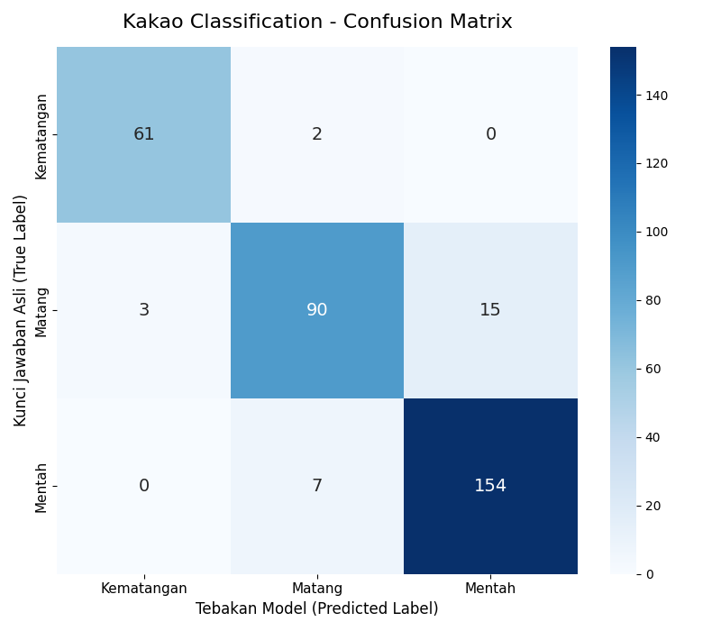

ROC multi-class baseline:

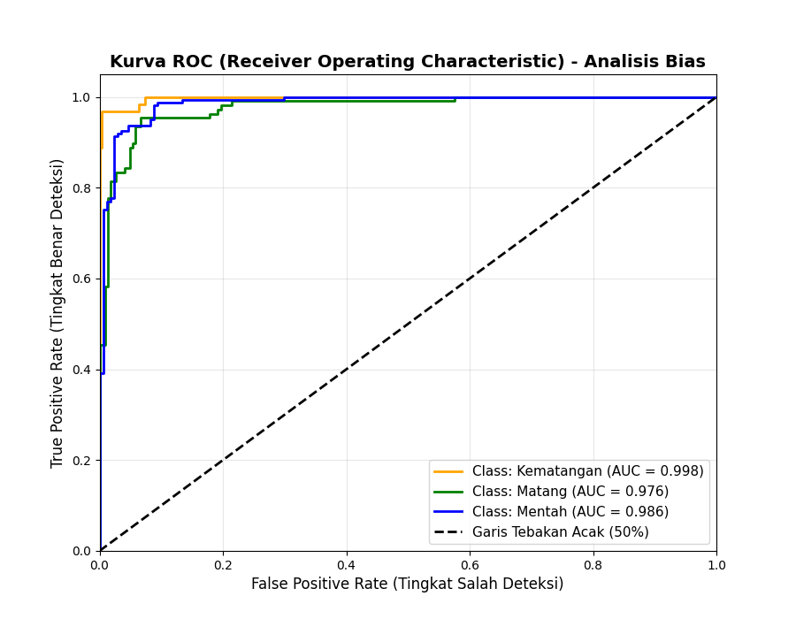

## Benchmark Perbandingan Model

Benchmark dijalankan melalui [scripts/08_model_benchmark.py](scripts/08_model_benchmark.py). Model yang dibandingkan tidak dipilih secara acak, tetapi berdasarkan karakter data yang sangat bergantung pada warna dan tekstur.

### Model yang Dibandingkan

1. `HSV Histogram + HOG + Linear SVM`
   Pendekatan klasik untuk melihat seberapa jauh fitur manual bisa menangkap warna dan tekstur buah.

2. `MobileNetV2 Embeddings + Logistic Regression`
   Pendekatan ringan yang masih sejalan dengan kebutuhan deployment.

3. `EfficientNetB0 Embeddings + Logistic Regression`
   Backbone yang lebih kuat untuk melihat apakah representasi fitur yang lebih baik memberi kenaikan performa yang nyata.

4. `Saved MobileNetV2 Keras Head`
   Model baseline deployable yang sudah ada di repo saat ini.

### Ringkasan Hasil Uji

| Model | Accuracy | Precision Macro | Recall Macro | F1 Macro |
| --- | ---: | ---: | ---: | ---: |
| EfficientNetB0 Embeddings + Logistic Regression | `0.9518` | `0.9555` | `0.9523` | `0.9539` |
| MobileNetV2 Embeddings + Logistic Regression | `0.9367` | `0.9332` | `0.9399` | `0.9364` |
| Saved MobileNetV2 Keras Head | `0.9157` | `0.9106` | `0.9131` | `0.9108` |
| HSV Histogram + HOG + Linear SVM | `0.7169` | `0.7053` | `0.7132` | `0.7084` |

### Visual Perbandingan

Visual ringkas:

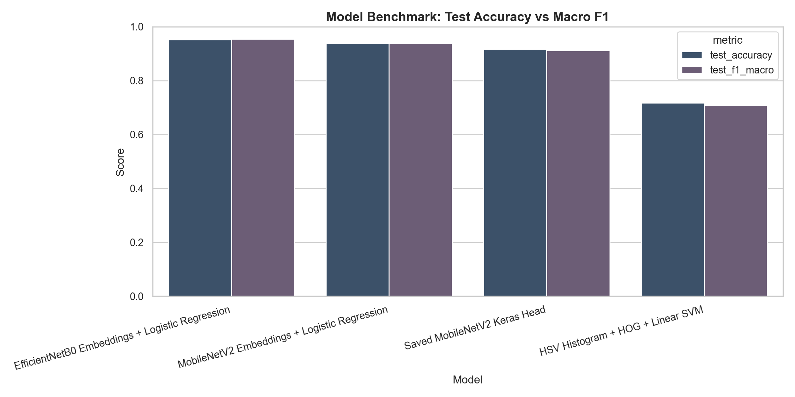

Visual lengkap:


### Interpretasi Hasil

- `EfficientNetB0 Embeddings + Logistic Regression` menjadi model terbaik pada split saat ini.
- `MobileNetV2 Embeddings + Logistic Regression` juga cukup kuat, dan tetap menarik bila prioritas utama adalah efisiensi model.
- `Saved MobileNetV2 Keras Head` masih layak sebagai baseline deployable, tetapi performanya di bawah dua model embedding.
- `HSV Histogram + HOG + Linear SVM` tertinggal cukup jauh, sehingga pendekatan fitur manual saja belum cukup kuat untuk kasus ini.
- Kelas yang paling sulit tetap `Matang`, karena secara visual berada di fase transisi antara `Mentah` dan `Kematangan`.

### Confusion Matrix per Model

- 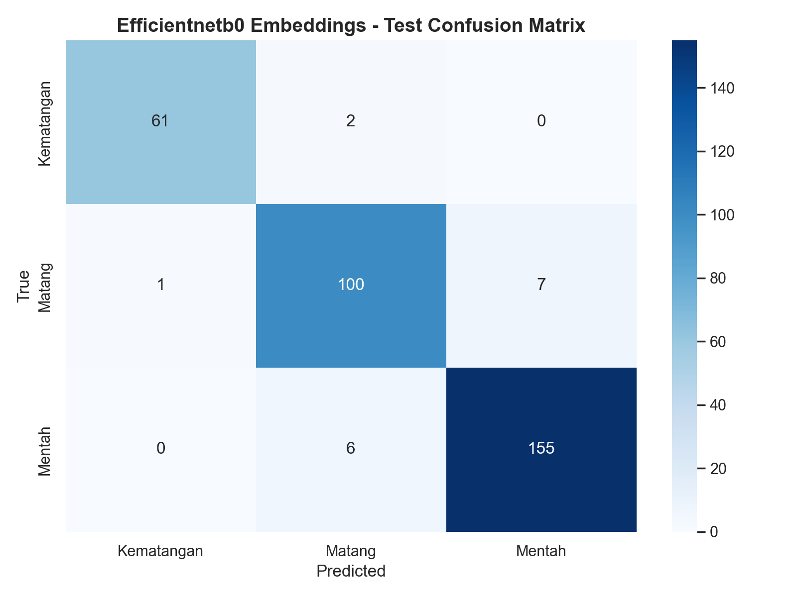
- 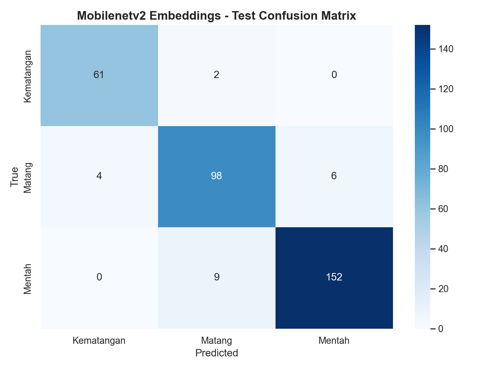
- 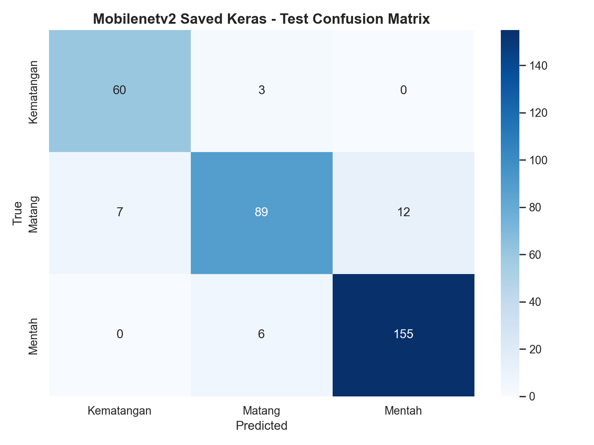
- 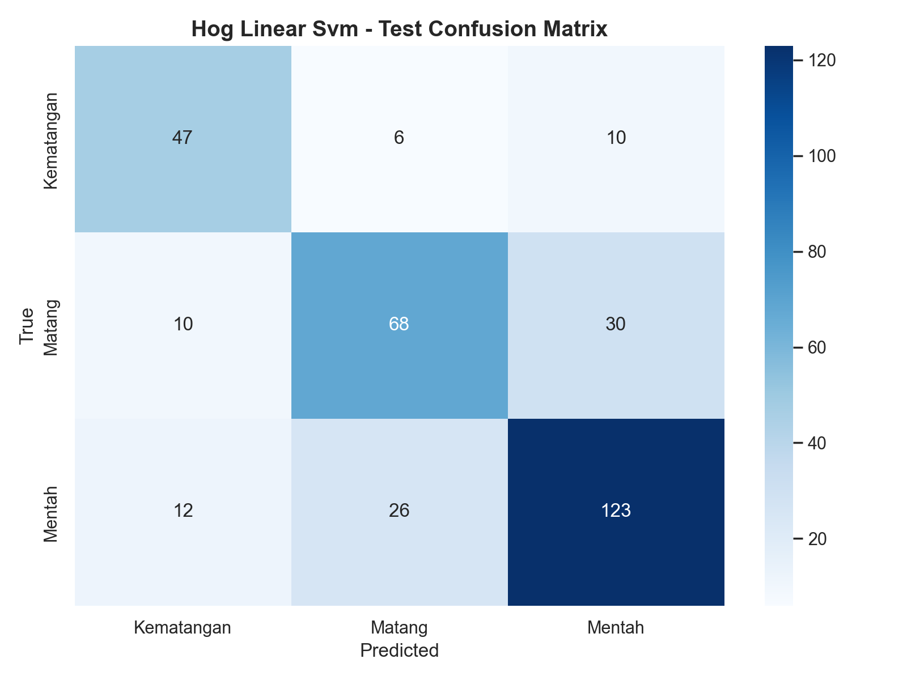

File benchmark yang tersedia:

- [outputs/08_model_benchmark_results.json](outputs/08_model_benchmark_results.json)
- [outputs/08_model_comparison.csv](outputs/08_model_comparison.csv)
- [outputs/08_model_comparison.md](outputs/08_model_comparison.md)

## Kesimpulan Sementara

Untuk kondisi repo saat ini, ada dua hal yang perlu dibedakan:

- Model terbaik berdasarkan benchmark adalah `EfficientNetB0 Embeddings + Logistic Regression`
- Model yang paling siap untuk integrasi langsung adalah `MobileNetV2 baseline`, karena artefak `.keras` dan `.tflite` sudah tersedia

Dengan kata lain, model terbaik untuk akurasi dan model paling siap deploy saat ini belum sama.

## Rekomendasi Lanjutan

- Hapus duplikat exact dari dataset, lalu lakukan split ulang
- Gunakan class weight saat training ulang model end-to-end
- Coba fine-tuning backbone MobileNetV2, bukan hanya head sederhana
- Siapkan versi end-to-end dari keluarga `EfficientNetB0` bila target utama adalah performa server-side
- Pertahankan `MobileNetV2` bila target utamanya adalah model yang ringan untuk integrasi aplikasi

## Cara Menjalankan

Install dependency:

```bash
pip install -r requirements.txt
```

Jalankan pipeline baseline:

```bash
python scripts/01_data_consolidation.py
python scripts/02_data_understanding.py
python scripts/03_preprocessing_split.py
python scripts/04_model_training.py
python scripts/04b_save_class_indices.py
python scripts/05_model_evaluation.py
python scripts/05b_roc_auc_evaluation.py
python scripts/06_export_model.py
```

Jalankan audit, benchmark, dan visualisasi perbandingan:

```bash
python scripts/07_dataset_audit.py
python scripts/08_model_benchmark.py
python scripts/09_model_performance_visualization.py
```

## Catatan

- Nilai runtime pada benchmark tidak saya jadikan dasar utama perbandingan, karena sebagian proses memanfaatkan cache feature extractor.
- Artefak `.tflite` yang tersedia saat ini masih berasal dari baseline MobileNetV2.
- Sebelum dipakai sebagai model final production, dataset sebaiknya dibersihkan dulu dari duplikasi dan diuji ulang pada split yang baru.
