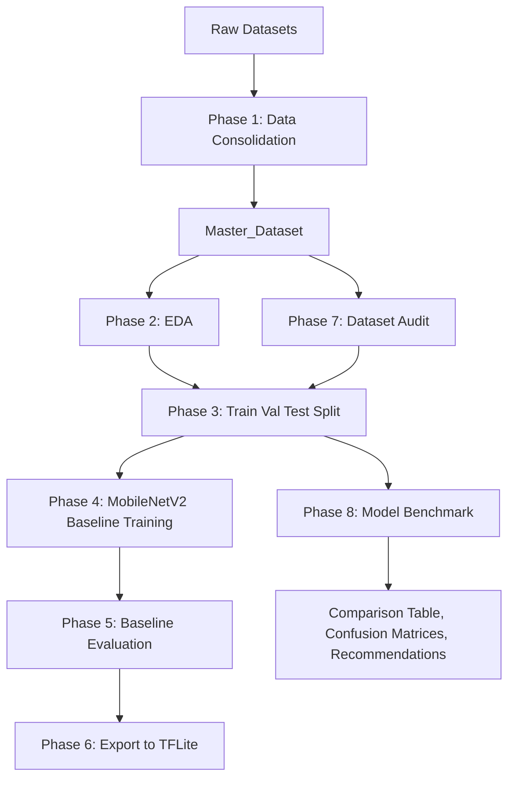

# Cocoa Ripeness Classification

End-to-end computer vision project for classifying cocoa pod ripeness into three classes:

- `Mentah` (unripe)
- `Matang` (ripe)
- `Kematangan` (overripe)

The repository now contains two parallel tracks:

1. A deployable baseline pipeline that produces a `.keras` model and a `.tflite` artifact for application integration.
2. An experimental benchmark pipeline for comparing multiple model approaches with a consistent evaluation protocol.

## Current Snapshot

- Total curated images: `3,287`
- Dataset split: `2,628 train / 327 val / 332 test`
- Current deployable artifact: [models/mobilenetv2_baseline/model_kakao_optimized.tflite](models/mobilenetv2_baseline/model_kakao_optimized.tflite)
- Current stored end-to-end model: [models/mobilenetv2_baseline/best_kakao_model.keras](models/mobilenetv2_baseline/best_kakao_model.keras)
- Best benchmarked approach on the current split: `EfficientNetB0 embeddings + Logistic Regression`
- Best benchmark test metrics:
  - Accuracy: `0.9518`
  - Precision (macro): `0.9555`
  - Recall (macro): `0.9523`
  - F1-score (macro): `0.9539`

## Updated Pipeline


```mermaid
graph TD
    A[Raw Datasets] --> B[Phase 1: Data Consolidation]
    B --> C[Master_Dataset]
    C --> D[Phase 2: EDA]
    C --> E[Phase 7: Dataset Audit]
    D --> F[Phase 3: Train Val Test Split]
    E --> F
    F --> G[Phase 4: MobileNetV2 Baseline Training]
    G --> H[Phase 5: Baseline Evaluation]
    H --> I[Phase 6: Export to TFLite]
    F --> J[Phase 8: Model Benchmark]
    J --> K[Comparison Table, Confusion Matrices, Recommendations]
```

## Repository Structure

```text
.
|-- models/
|   |-- efficientnetb0_embeddings/
|   |   |-- classifier.joblib
|   |   |-- feature_extractor.weights.h5
|   |   `-- metadata.json
|   |-- hog_linear_svm/
|   |   |-- classifier.joblib
|   |   `-- metadata.json
|   |-- mobilenetv2_baseline/
|   |   |-- artifact_manifest.json
|   |   |-- best_kakao_model.keras
|   |   |-- class_indices.json
|   |   `-- model_kakao_optimized.tflite
|   `-- mobilenetv2_embeddings/
|       |-- classifier.joblib
|       |-- feature_extractor.weights.h5
|       `-- metadata.json
|-- outputs/
|   |-- 03_*.png
|   |-- 04_*.png
|   |-- 05_*.png
|   |-- 07_*.png
|   `-- 08_*.{png,json,csv,md}
|-- scripts/
|   |-- 01_data_consolidation.py
|   |-- 02_data_understanding.py
|   |-- 03_preprocessing_split.py
|   |-- 04_model_training.py
|   |-- 04b_save_class_indices.py
|   |-- 05_model_evaluation.py
|   |-- 05b_roc_auc_evaluation.py
|   |-- 06_export_model.py
|   |-- 07_dataset_audit.py
|   `-- 08_model_benchmark.py
`-- requirements.txt
```

## Dataset Audit

The dataset audit is implemented in [scripts/07_dataset_audit.py](scripts/07_dataset_audit.py) and exports machine-readable summaries plus visual diagnostics.

### Dataset Suitability for 3-Class Classification

The dataset is suitable for a 3-class image classification task because:

- Each class has enough images to support transfer learning.
- The classes are visually meaningful and primarily separated by color progression and surface texture changes.
- The current train/val/test split is already stratified by folder structure and gives stable evaluation counts per class.

### Dataset Profile

| Metric | Value |
| --- | --- |
| Total images | `3287` |
| Class distribution | `Mentah 1597`, `Matang 1069`, `Kematangan 621` |
| Class percentages | `48.59%`, `32.52%`, `18.89%` |
| Imbalance ratio (max/min) | `2.5717x` |
| Image format | `100% JPEG` |
| Width range | `224` to `5568` px |
| Height range | `224` to `5568` px |
| Median resolution | `505 x 505` px |
| Aspect ratio range | `0.45` to `2.22` |
| Exact duplicate groups in master dataset | `4` |
| Cross-split duplicate groups | `1` |

### Class Weights Suggested by the Audit

These weights can be used in future Keras training runs to reduce the effect of imbalance:

- `Mentah`: `0.6861`
- `Matang`: `1.0249`
- `Kematangan`: `1.7644`

### Feature Relevance Findings

- Color is a meaningful feature. Mean RGB intensity differs across classes, which matches the biological progression from green to yellow/darkened pods.
- Texture is also relevant, especially for `Kematangan`, where surface degradation becomes visible.
- Because both color and texture matter, transfer learning on natural-image backbones is technically justified.
- The moderate imbalance is not severe enough to invalidate training, but it is large enough that macro metrics should be prioritized over accuracy alone.

### Quality Risks Found

- There are `4` groups of exact duplicate images in `Master_Dataset`.
- There is `1` exact duplicate group leaking across `train` and `test`.
- Resolution varies widely, so naive fixed resize may distort some samples.

Relevant outputs:

- [outputs/07_dataset_summary.json](outputs/07_dataset_summary.json)
- [outputs/07_exact_duplicates.csv](outputs/07_exact_duplicates.csv)
- [outputs/07_cross_split_duplicates.csv](outputs/07_cross_split_duplicates.csv)
- 
- 
- 
- 

## Model Exploration Strategy

The benchmark in [scripts/08_model_benchmark.py](scripts/08_model_benchmark.py) does not compare arbitrary models. Each approach was chosen for a specific technical reason:

### 1. HSV Histogram + HOG + Linear SVM

- Serves as a classical machine learning baseline.
- Relevant because cocoa ripeness is visibly tied to color and local texture.
- Useful to test whether handcrafted features alone are enough.

### 2. MobileNetV2 Embeddings + Logistic Regression

- Uses a lightweight pretrained visual backbone.
- Strong fit for small-to-medium datasets and constrained deployment settings.
- Aligned with the current mobile-friendly direction of the project.

### 3. EfficientNetB0 Embeddings + Logistic Regression

- Uses a stronger parameter-efficient pretrained backbone.
- Relevant when dataset size is limited but better representation quality is needed.
- Good candidate for server-side web inference where model size is less restrictive than on-device inference.

### 4. Saved MobileNetV2 Keras Head

- Evaluates the current end-to-end model already stored in this repository.
- This is the most directly deployable baseline because it already exists as a Keras model and TFLite artifact.

## Benchmark Results

All models were evaluated on the same `train / val / test` split with the following metrics:

- Accuracy
- Precision
- Recall
- F1-score
- Confusion matrix

### Test Set Comparison

| Model | Family | Test Accuracy | Test Precision Macro | Test Recall Macro | Test F1 Macro |
| --- | --- | ---: | ---: | ---: | ---: |
| EfficientNetB0 Embeddings + Logistic Regression | Transfer Learning + Linear Classifier | `0.9518` | `0.9555` | `0.9523` | `0.9539` |
| MobileNetV2 Embeddings + Logistic Regression | Transfer Learning + Linear Classifier | `0.9367` | `0.9332` | `0.9399` | `0.9364` |
| Saved MobileNetV2 Keras Head | End-to-End Transfer Learning | `0.9157` | `0.9106` | `0.9131` | `0.9108` |
| HSV Histogram + HOG + Linear SVM | Classical ML | `0.7169` | `0.7053` | `0.7132` | `0.7084` |

Full exported comparison:

- [outputs/08_model_comparison.csv](outputs/08_model_comparison.csv)
- [outputs/08_model_comparison.md](outputs/08_model_comparison.md)
- 

### Per-Class Behavior on the Test Set

#### EfficientNetB0 Embeddings + Logistic Regression

- `Kematangan`: Precision `0.9839`, Recall `0.9683`, F1 `0.9760`
- `Matang`: Precision `0.9259`, Recall `0.9259`, F1 `0.9259`
- `Mentah`: Precision `0.9568`, Recall `0.9627`, F1 `0.9598`

#### MobileNetV2 Embeddings + Logistic Regression

- `Kematangan`: Precision `0.9385`, Recall `0.9683`, F1 `0.9531`
- `Matang`: Precision `0.8991`, Recall `0.9074`, F1 `0.9032`
- `Mentah`: Precision `0.9620`, Recall `0.9441`, F1 `0.9530`

#### Saved MobileNetV2 Keras Head

- `Kematangan`: Precision `0.8955`, Recall `0.9524`, F1 `0.9231`
- `Matang`: Precision `0.9082`, Recall `0.8241`, F1 `0.8641`
- `Mentah`: Precision `0.9281`, Recall `0.9627`, F1 `0.9451`

### Confusion Matrices

- 
- 
- 
- 

## Interpretation

### What the Results Show

- The classical handcrafted baseline underperforms heavily. This indicates that the problem is not well solved by manual color/texture descriptors alone.
- Both transfer-learning embedding pipelines outperform the currently stored end-to-end MobileNetV2 model.
- `EfficientNetB0 embeddings + Logistic Regression` is the strongest model on the current split.
- The hardest class is consistently `Matang`, which makes sense because it is the biological transition class between `Mentah` and `Kematangan`.

### Overfitting and Underfitting Assessment

- The stored MobileNetV2 baseline does not show evidence of severe overfitting from the available validation/test gap.
- However, it appears under-optimized relative to the stronger embedding-based benchmarks.
- The HOG + SVM baseline behaves like an underfit classical model for this problem.
- The best benchmarked model has close validation and test performance, which suggests good generalization on the current split.

### Strengths and Weaknesses by Model

| Model | Strengths | Weaknesses |
| --- | --- | --- |
| HSV Histogram + HOG + Linear SVM | Simple, explainable, no deep model dependency | Accuracy too low for production use |
| MobileNetV2 Embeddings + Logistic Regression | Lightweight backbone, strong performance, deployment-aligned | Still below EfficientNetB0 on the same split |
| EfficientNetB0 Embeddings + Logistic Regression | Best overall accuracy and macro F1, strongest `Matang` performance | Not yet packaged as a single deployable TFLite artifact |
| Saved MobileNetV2 Keras Head | Already available as `.keras` and `.tflite`, easiest integration path | Lower macro recall on `Matang`, clearly behind the best benchmark |

## Recommendations

### Best Model Recommendation

For the current benchmark, the technically best model is:

- `EfficientNetB0 embeddings + Logistic Regression`

Reason:

- Highest accuracy and macro F1 on the held-out test set
- Best overall balance across all three classes
- Strong improvement on `Matang`, the hardest class in the dataset

### Recommended Next Step for Deployment

There are two reasonable deployment paths:

1. If the target is server-side web inference:
   Use the `EfficientNetB0` approach as the next main candidate.
2. If the target is mobile or a single-file on-device model:
   Keep `MobileNetV2` as the deployment family, but retrain it with a stronger training recipe.

### Recommended Preprocessing Improvements

- Remove duplicate images before the next definitive benchmark.
- Rebuild the split after deduplication to eliminate the known train/test leakage.
- Use class weights or targeted augmentation for `Kematangan` and `Matang`.
- Consider aspect-ratio-preserving resize plus padding instead of direct resize for outlier image shapes.
- Add stronger color and lighting augmentation, but preserve label semantics.

### Recommended Modeling Improvements

- Retrain an end-to-end `EfficientNetB0` classifier so the best-performing family can also be exported cleanly.
- Fine-tune the upper layers of MobileNetV2 instead of only using a short frozen-head baseline.
- Increase epochs beyond the current `5`-epoch baseline and use callbacks plus class weights.
- Add k-fold cross-validation or repeated hold-out validation before final production sign-off.

### Production Readiness Assessment

The dataset is usable for continued development, but not yet ideal for final production without cleanup:

- Positive:
  - Enough data for transfer learning
  - Clear visual signal for the target classes
  - Strong benchmark results from modern pretrained features
- Risks:
  - Moderate class imbalance
  - One confirmed cross-split duplicate leak
  - Wide image resolution variance
  - No external hold-out set yet

## How to Run

Install dependencies:

```bash
pip install -r requirements.txt
```

Run the original baseline pipeline:

```bash
python scripts/01_data_consolidation.py
python scripts/02_data_understanding.py
python scripts/03_preprocessing_split.py
python scripts/04_model_training.py
python scripts/04b_save_class_indices.py
python scripts/05_model_evaluation.py
python scripts/05b_roc_auc_evaluation.py
python scripts/06_export_model.py
```

Run the new audit and benchmark pipeline:

```bash
python scripts/07_dataset_audit.py
python scripts/08_model_benchmark.py
```

## Output Artifacts

### Deployable Model Artifacts

- [models/mobilenetv2_baseline/best_kakao_model.keras](models/mobilenetv2_baseline/best_kakao_model.keras)
- [models/mobilenetv2_baseline/model_kakao_optimized.tflite](models/mobilenetv2_baseline/model_kakao_optimized.tflite)
- [models/mobilenetv2_baseline/class_indices.json](models/mobilenetv2_baseline/class_indices.json)

### Audit Artifacts

- [outputs/07_dataset_summary.json](outputs/07_dataset_summary.json)
- [outputs/07_dataset_inventory.csv](outputs/07_dataset_inventory.csv)
- [outputs/07_exact_duplicates.csv](outputs/07_exact_duplicates.csv)
- [outputs/07_cross_split_duplicates.csv](outputs/07_cross_split_duplicates.csv)

### Benchmark Artifacts

- [outputs/08_model_benchmark_results.json](outputs/08_model_benchmark_results.json)
- [outputs/08_model_comparison.csv](outputs/08_model_comparison.csv)
- [outputs/08_model_comparison.md](outputs/08_model_comparison.md)

## Notes

- The benchmark runtime depends on CPU-only execution in the current Windows environment.
- Runtime values in the benchmark are useful operationally, but they are not perfectly apples-to-apples because feature extraction and inference workloads differ by approach.
- The current stored `.keras` and `.tflite` artifacts come from the baseline MobileNetV2 pipeline, not from the new benchmark winner.
